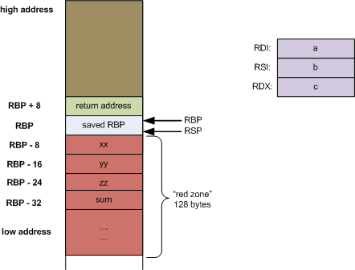

# Еще пару важных моментов про x86

***Вопрос:***  Зачем при вызове функции в x86-64 требуется, чтобы стек был выровнен по 16 байтам?

Стек должен быть выровнен по 16 байтам при вызове функции,
потому что архитектура x86-64 и ABI требуют этого для корректной и быстрой работы SSE/AVX-инструкций, которые обращаются к памяти 16-байтовыми (или 32-байтовыми для __m256) блоками.
Невыровненный стек может вызвать ошибку (#GP) или замедление, поэтому перед передачей управления функции гарантируется, что (%rsp + 8) кратно 16 — так каждая функция может безопасно использовать SIMD-инструкции и локальные данные на стеке.

Что такое **red zone** расположенная под указателем вершины стека ``rsp``?

Формальное определение из соглашения [AMD64 ABI]("https://refspecs.linuxfoundation.org/elf/x86_64-abi-0.99.pdf") гласит что: 
>The 128-byte area beyond the location pointed to by %rsp is considered to be reserved and shall not be modified by signal or interrupt handlers. Therefore, functions may use this area for temporary data that is not needed across function calls. In particular, leaf functions may use this area for their entire stack frame, rather than adjusting the stack pointer in the prologue and epilogue. This area is known as the red zone.

Иначе говоря:

* Операционная система и обработчики прерываний не трогают эти 128 байт.

* Функция может временно использовать их для хранения локальных данных,
не изменяя rsp (т.е. без sub rsp, N).

* Но использовать red zone можно только в leaf-функциях,
которые не вызывают другие функции,
потому что call всё равно сдвигает стек (rsp -= 8).

Рассмотрим программу:

```
long utilfunc(long a, long b, long c)
{
    long xx = a + 2;
    long yy = b + 3;
    long zz = c + 4;
    long sum = xx + yy + zz;

    return xx * yy * zz + sum;
}

```



См. здесь: https://eli.thegreenplace.net/2011/09/06/stack-frame-layout-on-x86-64

### Что можно еще сделать?

1) Подмена rip и передача управления другой функции(см. ``rip_change.s``)
2) Установка RIP в конкретный адрес через
```set $rip = 0x400123```

# ARM ассемблер

Теперь поговорим про ARM ассемблер (конкретнее, про AArch64). Процессоры на базе архитектуры ARM устанавливаются в компьютеры Apple, а также большинство портативной электроники (смартфонов, планшетов и так далее). Архитектура ощутимо эффективнее x86, поэтому многие считают, что за ним будущее.

ARM — это не одна архитектура, а целое семейство инструкционных наборов (ISA), которые развивались десятилетиями:

| Поколение     | Название ISA          | Разрядность | Пример процессоров                        |
| ------------- | --------------------- | ----------- | ----------------------------------------- |
| ARMv4 / ARMv5 | ARM / Thumb           | 32-бит      | старые телефоны, микроконтроллеры         |
| ARMv7-A       | ARM / Thumb-2         | 32-бит      | Raspberry Pi 2, Cortex-A9                 |
| **ARMv8-A**   | **AArch32 + AArch64** | 32 и 64 бит | Raspberry Pi 3+, Apple M1, Snapdragon 8   |
| ARMv9-A       | AArch64               | 64-бит      | современные чипы (Apple M2/M3, Cortex-X4) |


## Настройка окружения

Необходимо скачать компилятор и библиотеки для другой платформы из проекта [Linaro](http://releases.linaro.org/components/toolchain/binaries/7.5-2019.12/aarch64-linux-gnu/). 

Для запуска программ написанных процессоре x86 используем эмулятор ARM Qemu. Скачиваем так

```
sudo apt install qemu-user
``` 

Полезно в `~/.bashrc` дописать алиасы наподобие:

```
alias agcc='/opt/aarch64-gcc/bin/aarch64-linux-gnu-gcc'
alias agdb='/opt/aarch64-gcc/bin/aarch64-linux-gnu-gdb'
alias aobjdump='/opt/aarch64-gcc/bin/aarch64-linux-gnu-objdump'
alias arun='qemu-aarch64 -L /opt/aarch64-sysroot'
```

## Регистры и соглашения о вызовах

В `armv8` есть 31 64-битный регистр общего назначения, доступных программно: `x0`, `x1`,  ... , `x30`. Через `w0`, `w1`, ..., `w30` можно обращаться к младшим 32 битам этих регистров. 

В системе Linux предусмотрены следующие соглашения об использовании регистров:

| Регистры        | Назначение                                                   |
| --------------- | ------------------------------------------------------------ |
| `x0` ... `x7`   | аргументы функции и возвращаемое значение (`x0`)             |
| `x8` ... `x18`  | временные регистры, для которые не гарантируется сохранение результата, если вызывать какую-либо функцию |
| `x19` ... `x28` | регистры, для которых гарантируется, что вызываемая функция их не будет портить |
| `x29`           | указатель на границу фрейма функции, обычно используется отладчиком |
| `x30`      | адрес возврата из функции                                    |
| `sp`      | указатель на вершину стека                                   |

Команда `mov a b` копирует в регистр `a` данные из регистра `b`. Для работы с памятью, в отличии от `x86_64`, предусмотрены специальные инструкции `ldr/str register [address]`. Первая загружает данные в регистр, а вторая в память. Как и в случае `mov` в `x86_64`, для оперирования числами меньшего размера есть специальные суффиксы: `ldrb` загружает `uint8_t`, `ldrsb` загружает `int8_t` и так далее (суффикс `h` используется для 2 байтов, `w` для 4 байтов). Пример использования можно посмотреть в `arr_get.S`.

## Арифметические команды

Ещё в нашем минимальном примере можно увидеть некоторые арифметические команды. У большинства из них вид `command res, left, right`. Этот синтаксис означает `res = left + right` где `+` -- произвольная операция: `add`, `sub`, `mul`, `and`, `orr` и так далее. Довольно полезная инструкция `madd res, mleft, mright, anum` делает `mres=mleft*mright+anum`.

## Метки и переходы

Аналогично `x86_64` можно создавать метки и переходить по ним. Для безусловного перехода предназначена команда `b label`. Команда `cmp` сравнивает числа и выставляет специальные флаги. На основе этих флагов работают суффиксы, которые можно дописать к команде `b`:

* `eq`, `ne` (проверка на равенство)
* `lt`, `le`, `gt`, `ge` (сравнение знаковых чисел)
* `hi`,`ls` (> и <= для беззнаковых )

Пример использования можно посмотреть в `sum_n.S`.

## Вызов функций

Для вызова функций есть команда `bl label`. Она кладёт в `x30` адрес следующей команды. При этом нужно не забыть сохранить исходный адрес возврата (например на стек). Для выхода из функции предназначена команда `ret`. Обратите внимание, что встроенных команд `push/pop` в `aarch64` нет, но можно реализовать их самим с помощью макросов. Пример можно посмотреть в `int_echo.S`.
